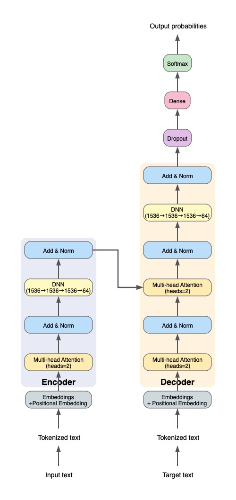

# Projects

## Featured Projects

### Scientific Literature RAG System
**AI-powered introduction generator for scientific papers**

*Live demonstration of the Scientific Literature RAG system generating introductions with semantic search and citation extraction.*

A production-ready RAG system that automatically generates well-structured, literature-informed introductions for scientific papers. The system indexes research papers and leverages LLMs to synthesize relevant literature into comprehensive introductions with properly formatted citations.

**Key Features:**
- **Multi-Provider LLM Support**: Claude (Anthropic), OpenAI GPT-4/GPT-4o, Google Gemini
- **SPECTER2 Embeddings**: Domain-optimized scientific embeddings for superior semantic understanding
- **GPU Acceleration**: Metal GPU support for Apple Silicon, CUDA for NVIDIA, automatic CPU fallback
- **Smart PDF Processing**: Semantic chunking (500-word chunks with 50-word overlap)
- **ChromaDB Vector Search**: Persistent local storage with cosine similarity search
- **Automatic BibTeX Citations**: Extracts and formats references with sophisticated metadata extraction
- **Interactive Dash UI**: User-friendly web interface for literature exploration
- **ROUGE Evaluation**: Built-in evaluation metrics for assessing generation quality (F1 scores >0.5)

**Performance:**
- Embedding: 50-100 chunks/second on Apple Silicon
- Generation: 10-30 seconds per introduction
- Indexing: ~1 minute per 100 PDFs

**Technologies:** Python 3.11+, GPU, LLM, ChromaDB, SPECTER2, RAG, Dash  
**Status:** Production Ready | Apache 2.0 License  
[→ View on GitHub](https://github.com/jvachier/scientific-literature-rag)

---

### Speech-to-Text with Sentiment Analysis and Translation
**Real-time multilingual processing pipeline**

*Detailed architecture of the Transformer model showing encoder-decoder structure with multi-head attention mechanisms.*

A comprehensive end-to-end system integrating speech recognition, sentiment analysis, and neural machine translation. Built with from-scratch Transformer implementation demonstrating deep understanding of attention mechanisms and encoder-decoder architectures.

**Key Features:**
- **Real-time Speech-to-Text**: Audio capture and transcription using Vosk library (English)
- **From-Scratch Transformer**: Complete encoder-decoder architecture without pre-trained models
- **Custom Multi-Head Attention**: Manually implemented attention mechanisms with configurable heads
- **Positional Encoding**: Hand-crafted sinusoidal position embeddings
- **Sentiment Classification**: Bidirectional LSTM with 95% test accuracy
- **Interactive Dash Web App**: Real-time processing with visual feedback and export functionality
- **Hyperparameter Optimization**: Automated tuning with Optuna for both models
- **BLEU Score Evaluation**: Translation quality metrics and model assessment

**Performance Metrics:**
- Sentiment Analysis (BiLSTM): 95.00% test accuracy
- Translation (Transformer): 67.26% test accuracy, 0.52 BLEU score
- Real-time processing with instant speech recognition and translation

**Architecture Highlights:**
- Educational implementation demonstrating core concepts
- Full control over attention mechanisms and positional encodings
- Research-grade code suitable for experimentation
- Clean, well-documented implementation

**Technologies:** Python 3.11+, Transformer, Bidirection LSTM, TensorFlow, Keras, Vosk, Dash, Optuna  
**Status:** Research/Educational | Apache 2.0 License  
[→ View on GitHub](https://github.com/jvachier/Sentiment_Analysis)

---

### Active Particles in 3D Confinement
**GPU-accelerated molecular dynamics simulation**

*Performance comparison across CPU and GPU implementations showing up to 27× speedup on Apple Silicon.*

A high-performance C++ simulation framework for modeling active Brownian particles (ABPs) under cylindrical confinement in 3D space. Implements Euler-Maruyama algorithm for Langevin dynamics with dual CPU/GPU implementations.

**Key Features:**
- **Dual Implementations**: CPU-only (OpenMP) and GPU hybrid (Metal) versions
- **GPU Acceleration**: Up to 27× speedup on Apple Silicon for large systems (N ≥ 1000)
- **Langevin Dynamics**: Proper stochastic noise generation with Euler-Maruyama integration
- **3D Cylindrical Confinement**: Reflective boundary conditions for realistic physical constraints
- **Lennard-Jones Interactions**: Repulsive particle-particle forces with configurable strength
- **OpenMP Parallelization**: Multi-threaded CPU optimization for all particle counts
- **Automatic CPU/GPU Selection**: Smart threshold-based switching for optimal performance
- **Numerical Stability**: Robust safeguards prevent NaN overflow at high particle densities

**Performance Benchmarks (Apple M2, 1000 timesteps):**

| Particles | CPU (1 thread) | CPU (OpenMP 6) | GPU (Metal) | GPU vs 1 CPU | GPU vs OpenMP |
|-----------|----------------|----------------|-------------|--------------|---------------|
| 100       | 0.026s         | 0.103s         | 0.096s      | 0.3×         | 0.9×          |
| 200       | 0.075s         | 0.125s         | 0.115s      | 0.7×         | 1.1×          |
| 500       | 0.401s         | 0.269s         | 0.225s      | **1.8×**     | **1.2×**      |
| 1,000     | 1.514s         | 0.747s         | 0.445s      | **3.4×**     | **1.7×**      |
| 2,000     | 5.638s         | 2.389s         | 0.601s      | **9.4×**     | **4.0×**      |
| 5,000     | 34.393s        | 13.903s        | 1.262s      | **27.3×**    | **11.0×**     |

**Physical Model:**
- Active Brownian particles with self-propulsion
- Translational and rotational diffusion
- Repulsive Lennard-Jones potential
- Applications: bacterial suspensions, cell motility, colloidal systems

**Technologies:** C++17, OpenMP, Metal GPU 
**Status:** Research-Grade | Apache 2.0 License  
[→ View on GitHub](https://github.com/jvachier/active_particles_in_3D)

---

### Personality Classification with Ensemble Learning
**Production ML pipeline achieving Kaggle top 5%**

*Interactive dashboard for real-time personality classification with model explainability and performance metrics.*

A production-ready machine learning pipeline for personality classification using ensemble learning, achieving **top 5% (200/4,329)** in the [Kaggle Personality Classification Competition](https://www.kaggle.com/competitions/playground-series-s5e7). Features modular architecture, automated hyperparameter optimization, and interactive visualization.

**Key Features:**
- **Six Ensemble Stacks**: Complementary ML algorithms (Random Forest, XGBoost, LightGBM, CatBoost, Neural Networks)
- **Advanced Data Augmentation**: SDV Copula-based synthetic data generation with quality control
- **Automated Hyperparameter Optimization**: Optuna-powered tuning for each stack (200+ trials for blending)
- **Interactive Dash Dashboard**: Real-time predictions, model explainability, and performance visualization
- **Meta-Learning Approach**: Logistic Regression ensemble combiner with optimized blending weights
- **Out-of-Fold Predictions**: Unbiased ensemble training with stratified cross-validation
- **Production-Ready**: Full test coverage, CI/CD pipeline, comprehensive logging

**Ensemble Architecture:**

| Stack | Focus | Algorithms | Special Features |
|-------|-------|-----------|------------------|
| A | Traditional ML (Narrow) | RF, LR, XGBoost, LightGBM, CatBoost | Stable baseline |
| B | Traditional ML (Wide) | Same as A | Extended search space |
| C | Gradient Boosting | XGBoost, CatBoost | Tree specialists |
| D | Sklearn Ensemble | Extra Trees, Hist GB, SVM, Gaussian NB | Diverse mix |
| E | Neural Networks | MLPClassifier, Deep architectures | Non-linear patterns |
| F | Noise-Robust | Same as A + label noise | Improved generalization |

**Competition Results:**
- **Rank**: 200/4,329 (Top 5%)
- **Dataset**: ~18,000+ training samples (with augmentation), 8 personality dimensions
- **Cross-Validation**: Stratified 5-fold CV for robust evaluation

**Technologies:** Python 3.11+, scikit-learn, XGBoost, LightGBM, CatBoost, Optuna, Dash, Plotly
**Status**: Production Ready | Apache 2.0 License  
[→ View on GitHub](https://github.com/jvachier/Personality-classification)

---

## Open Source Contributions

All public projects available on [GitHub](https://github.com/jvachier)
